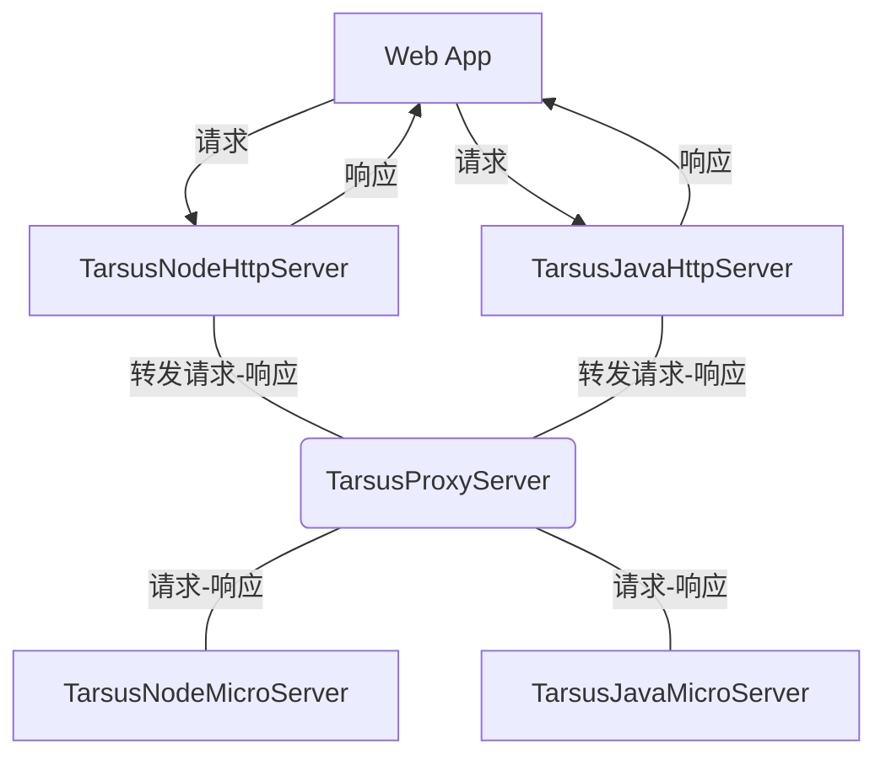

# Tarsus FrameWork

---

Tarsus FrameWork 由 [Ado](https://github.com/chelizichen/ado-node)项目升级改造而来，借助ECMAScript装饰器和Java8注解，可以快速创建并启动HTTP服务或微服务。 ECMAScript中的装饰器特性已经正式进入ES2018版本官方发布，这使得开发者无需担心兼容性问题。装饰器是一种特殊的语法抽象手段，可以装饰类，方法以及对象，使开发者更容易书写和管理程序逻辑，增加了程序的可读性，使其逻辑连贯可懂。此外，使用TypeScript和Java开发，可以提供更生动的语义，帮助Devs更迅速地工作，有效地防止程序错误和 bug 的发生。

---
## 整合的仓库

- [@Tarsus/Node](https://github.com/chelizichen/Tarsus) 包含 Http服务  微服务模块 依赖注入 ORM 命令行 等多个开发包的库
- [@Tarsus/Java-Proxy](https://github.com/chelizichen/Tarsus-Java-Proxy) SpringBoot，可以提供Http 服务，也可以调用微服务
- [@Tarsus/Java](https://github.com/chelizichen/Tarsus-Java) Java 微服务模块 示例代码

## 微服务架构模型



### 使用新版TypeScript

````TS
npm install typescript@beta
````

### 项目结构

- test
  - http @Tarsus/node-http 服务
  - micorservice @Tarsus/node 微服务
  - rpc.txt postman 调用微服务网关的 info
- decorator Tarsus框架所需的装饰器
  - ioc 依赖注入模块
  - web http 模块
  - microservice 微服务模块


## use ioc

````ts

// 收集依赖

@Collect
class AppService {
  hello() {
    console.log("hello world");
  }
}

// 注入依赖
class appController {
  @Inject(AppService)
  AppService!: AppService;

}
````

## use express http server

### Controller

````TS
// controlelr
@Controller("/demo")
class demoController {
  @Inject(AppService)
  AppService!: AppService;

  @Inject(TestService)
  TestService!: TestService;

  @Get("/test")
  public test(req: Request) {
    const data = req.query;
    const ret = this.TestService.hello();

    return { data, ret };
  }

  @Get("/say")
  public say() {}
}
````

### Service

````TS
// Service
@Collect
class TestService {
  hello() {
    console.log("hello world");
    return "hello world"
  }
}
````

### ORM

````ts
@Entity("goods")
class Goods extends TarsusOrm {
  @Column
  id: string;

  @Column("sort_type_id")
  SortTypeId: string;

  @Column("goods_name")
  GoodsName: string;

  @Column("goods_price")
  GoodsPrice: string;

  @Column("goods_rest_num")
  GoodsRestNum: string;

  @Column("seller_id")
  SellerId: string;

  @Column("sort_child_id")
  SortChildId: string;
}

export {
    Goods
}
````

### Mapper

````ts
@Mapper
class GoodsMapper{
    
    @Select("select * from goods where id = ? and sort_child_id = ?")
    async TestSelect(args){
        const data = await TarsusOrm.query(args, Goods);
        return data
    }
}

````

### GlobalPipe

````ts
class LogGlobalPipe implements TarsusGlobalPipe {
  next(
    req: Request<ParamsDictionary, any, any, ParsedQs, Record<string, any>>,
    res: Response<any, Record<string, any>>,
    next: NextFunction
  ): void {
    console.log(req.query);
    console.log(req.body);
    next();
  }
}
````

### Interceptor

````ts
class LogInterCeptor implements TarsusInterCeptor {
  handle(
    req: Request<ParamsDictionary, any, any, ParsedQs, Record<string, any>>
  ): any {
    const { id } = req.query;
    if (!id) {
      return "NEED PARAMS ID";
    }
    req.query = class_transformer.plainToClass(req.query, Goods);
  }
}
````

### run application

````TS
@TarsusHttpApplication(9811)
class TestApplication{
  static main () :void {
    loadController([appController]);
    loadGlobalPipe([LogGlobalPipe]);
    
    // init method
    loadInit((app) => {
      const public_path = path.resolve(cwd(), "public");
      app.use(express.static(public_path));
    });

    // run application
    loadServer();
  }
}

TestApplication.main()
````

## use POSTMAN to test

````txt
Get Request ->
localhost:9811/demo/test?data=111

return 
{
    "data": {
        "data": "111"
    },
    "ret": "hello world"
}

````
